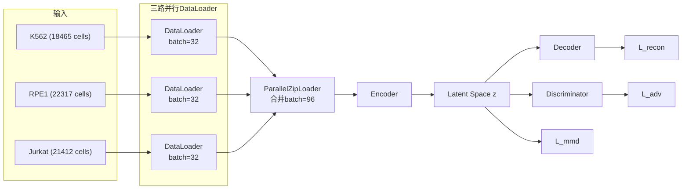
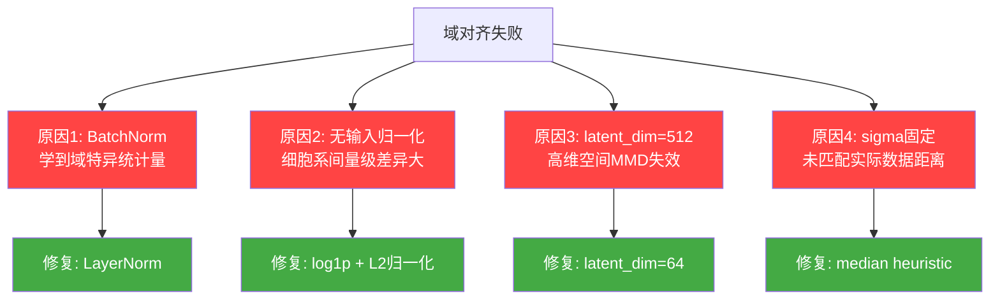

# MMD-AAE 项目进展报告

## 一、V1 版本实现详解

### 1.1 整体架构

MMD-AAE (Maximum Mean Discrepancy - Adversarial Autoencoder) 的目标是学习**域不变**的基因表达表示，使模型能够跨不同细胞系泛化。



### 1.2 三路并行 DataLoader

**核心设计**: 使用 `ParallelZipLoader` 确保每个 mini-batch 包含平衡的域样本。

```python
# 三个独立的 DataLoader
loader_k562 = DataLoader(k562_dataset, batch_size=32, shuffle=True, drop_last=True)
loader_rpe1 = DataLoader(rpe1_dataset, batch_size=32, shuffle=True, drop_last=True)
loader_jurkat = DataLoader(jurkat_dataset, batch_size=32, shuffle=True, drop_last=True)

# zip 同步迭代
for (batch_k562, batch_rpe1, batch_jurkat) in zip(loader_k562, loader_rpe1, loader_jurkat):
    x = concat([batch_k562, batch_rpe1, batch_jurkat])  # (96, 18080)
    domain_labels = [0]*32 + [1]*32 + [2]*32             # (96,)
```

**关键参数**:
- `drop_last=True`: 丢弃最后不完整的 batch，保证 zip 对齐
- `shuffle=True`: 每个 epoch 随机打乱
- 总 batch = 32×3 = 96，每 epoch 577 iterations

---

### 1.3 三个损失函数

#### L_recon (重建损失)

$$L_{recon} = \frac{1}{N} \sum_{i=1}^{N} \|x_i - \hat{x}_i\|^2$$

```python
recon_loss = MSE(Decoder(Encoder(x)), x)
```

- **目的**: 保留输入信息，确保隐空间有意义
- **权重**: λ_recon = 1.0

#### L_mmd (最大均值差异)

$$MMD^2(P,Q) = E[K(x,x')] + E[K(y,y')] - 2E[K(x,y)]$$

```python
# 多核 RBF: sigma = [0.01, 0.1, 1.0, 10.0, 100.0]
mmd_total = mean(MMD(z_K562, z_RPE1), MMD(z_K562, z_Jurkat), MMD(z_RPE1, z_Jurkat))
```

- **目的**: 显式拉近不同域的分布
- **权重**: λ_mmd = 1.0 ~ 20.0 (多次实验)

#### L_adv (对抗损失 + 梯度反转)

$$L_{adv} = CrossEntropy(D(GRL(z)), labels)$$

```python
z_reversed = GradientReversalLayer(z)  # 反转梯度方向
adv_loss = CrossEntropy(Discriminator(z_reversed), domain_labels)
```

- **目的**: Encoder 学习欺骗 Discriminator → 域不变特征
- **理想值**: log(3) ≈ 1.099 (随机猜测)
- **权重**: λ_adv = 0.1 ~ 0.5

#### 总损失

$$L_{total} = \lambda_r \cdot L_{recon} + \lambda_m \cdot L_{mmd} + \lambda_a \cdot L_{adv}$$

---

### 1.4 V1 模型架构

```python
Encoder:  18080 → [Linear+BN+ReLU] → 1024 → [Linear+BN+ReLU] → 512 → [Linear] → 512
Decoder:  512 → [Linear+BN+ReLU] → 512 → [Linear+BN+ReLU] → 1024 → [Linear] → 18080
Discriminator: 512 → 256 → 256 → 3
```

- 使用 **BatchNorm1d** 进行层归一化
- 隐空间维度: **512**
- 无输入数据预处理（直接使用原始 counts）

---

### 1.5 训练结果

#### 训练数值结果

| Epoch | Recon | MMD | Adv | 评估 |
|-------|-------|-----|-----|------|
| 1 | 0.60 | 0.0625 | 1.05 | MMD 固定不变 (Bug) |
| 10 | 0.15 | 0.0625 | 1.07 | ← 发现梯度断开 |
| **修复后** | | | | |
| 20 | 0.129 | **0.040** | 1.095 | MMD 开始下降 ✅ |

> [!NOTE]
> 初版中 `torch.tensor(0.0)` 导致 MMD 梯度断开，修复后使用 `x.new_zeros(1)` 恢复梯度流。

#### t-SNE 可视化结果

**实验 1: λ_m=20, 200 epochs**


**结果**: ❌ 三个域 (红K562/蓝RPE1/绿Jurkat) 完全分离，域对齐未生效。

**实验 2: λ_m=10, 200 epochs**


**结果**: 🟡 三域有轻微交叉，但整体仍然分离。λ_m=10 比 λ_m=20 效果更好（说明 MMD 权重过大反而不利）。

---

### 1.6 V1 问题总结

| 问题 | 原因 | 影响 |
|------|------|------|
| **MMD 梯度断开** | `torch.tensor(0.0)` 初始化 | MMD 无法优化 (已修复) |
| **域仍然分离** | 架构层面问题 | t-SNE 无重叠 |

---

## 二、V2 版本改进

### 2.1 问题根因分析

经过深入分析，发现域对齐失败不是 lambda 的问题，而是**架构层面的 4 个根本原因**：



---

### 2.2 修复 1: BatchNorm → LayerNorm（最关键）

**问题**: BatchNorm 在训练时计算每个 mini-batch 的均值和方差。由于我们的 batch 混合了三个域的数据，BN 会隐式地为模型提供域信息，帮助模型"记住"每个样本来自哪个域。

```diff
# V1 (问题)
- nn.Linear(input_dim, 1024),
- nn.BatchNorm1d(1024),     # ← 追踪域特异的 running_mean/running_var
- nn.ReLU(),

# V2 (修复)
+ nn.Linear(input_dim, 1024),
+ nn.LayerNorm(1024),       # ← 每个样本独立归一化，不依赖 batch
+ nn.ReLU(),
```

> [!IMPORTANT]
> **LayerNorm vs BatchNorm**:
> - BatchNorm: 沿 batch 维度归一化 → 依赖同 batch 其他样本 → 泄露域信息
> - LayerNorm: 沿特征维度归一化 → 每个样本独立处理 → 域无关

---

### 2.3 修复 2: 输入归一化

**问题**: 原始 gene counts 未经处理，不同细胞系的表达量分布差异巨大。

```diff
# V1: 直接使用原始 counts
- counts = torch.tensor(f['X'][idx], dtype=torch.float32)
- return counts

# V2: log1p + L2 归一化
+ counts = torch.tensor(f['X'][idx], dtype=torch.float32)
+ counts = torch.log1p(counts)        # log(1+x) 压缩大值
+ norm = counts.norm(p=2)
+ if norm > 0:
+     counts = counts / norm           # L2 归一化到单位球面
+ return counts
```

**效果**: 消除不同细胞系间的量级差异，让 MMD 在标准化空间中计算。

---

### 2.4 修复 3: latent_dim 512 → 64

**问题**: 512 维隐空间中，所有点对之间的距离趋于相同（"维度灾难"），导致 MMD 核函数区分能力大幅下降。

```diff
# V1
- Encoder: 18080 → 1024 → 512 → 512 (latent)
- Decoder: 512 → 512 → 1024 → 18080

# V2
+ Encoder: 18080 → 1024 → 256 → 64 (latent)
+ Decoder: 64 → 256 → 1024 → 18080
```

**原理**: 更小的瓶颈迫使 Encoder 压缩信息，丢弃域特异的细节，保留共性特征。

---

### 2.5 修复 4: MMD sigma 自动校准

**问题**: 固定的 sigma=[0.01, 0.1, 1.0, 10.0, 100.0] 可能不匹配实际隐空间中点对间的距离。

```diff
# V1: 固定 sigma
- sigmas = [0.01, 0.1, 1.0, 10.0, 100.0]

# V2: median heuristic (自动适配)
+ all_dists = concat(dxx, dyy, dxy)
+ median_dist = all_dists.median()
+ sigmas = [median_dist * f for f in [0.1, 0.25, 0.5, 1.0, 2.0, 5.0]]
```

**原理**: 使用数据点对距离的中位数作为 sigma 基准，确保核函数在有效范围内工作。

---

### 2.6 其他改进

| 改项 | V1 | V2 |
|------|-----|-----|
| 学习率 | 1e-4 | **1e-3** |
| LR 最低值 | 0 (完全衰减) | **1e-5** (保持训练) |
| 默认 epochs | 20 | **50** |

---

### 2.7 V1 vs V2 架构对比

| 组件 | V1 | V2 |
|------|-----|-----|
| **归一化层** | BatchNorm1d | **LayerNorm** |
| **输入预处理** | 无 | **log1p + L2** |
| **隐空间维度** | 512 | **64** |
| **MMD sigma** | 固定 5 个值 | **Median heuristic** |
| **Encoder** | 18080→1024→512→512 | **18080→1024→256→64** |
| **模型参数量** | ~38M | **~20M** |

---

## 三、下一步

1. **运行 V2 实验**（已在 tmux 中启动）
2. **生成新的 t-SNE 可视化**，对比 V1 与 V2
3. **如果 V2 域对齐成功**，进行 zero-shot 评估
4. **集成到 STATE Transformer**
