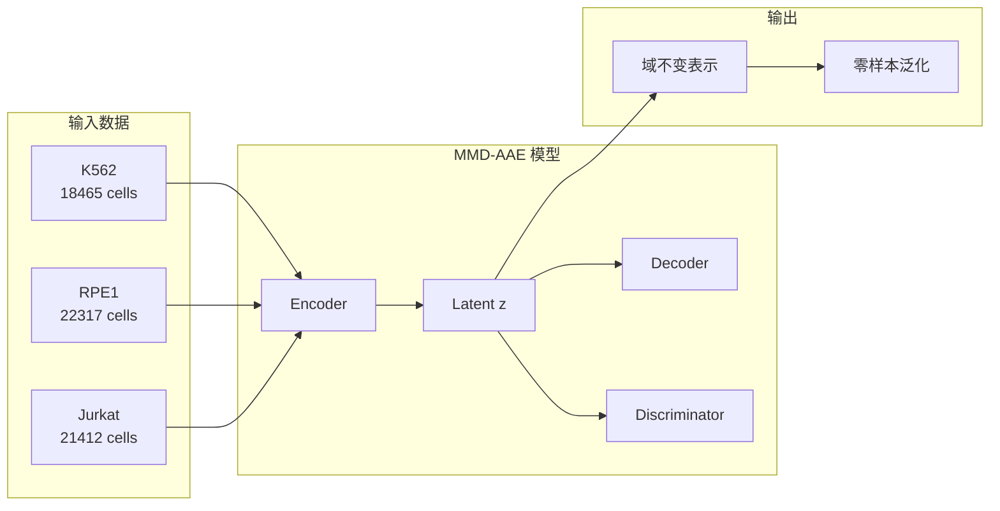
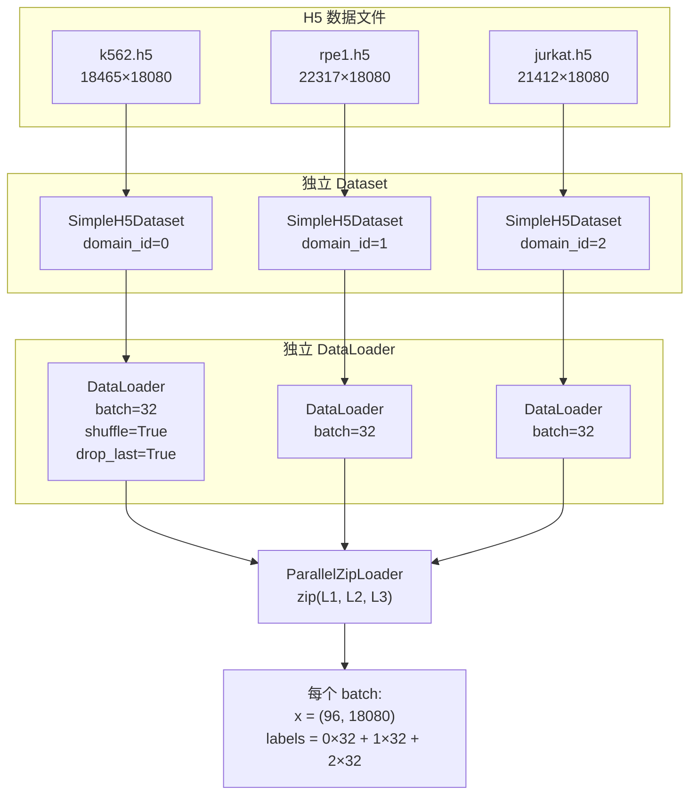
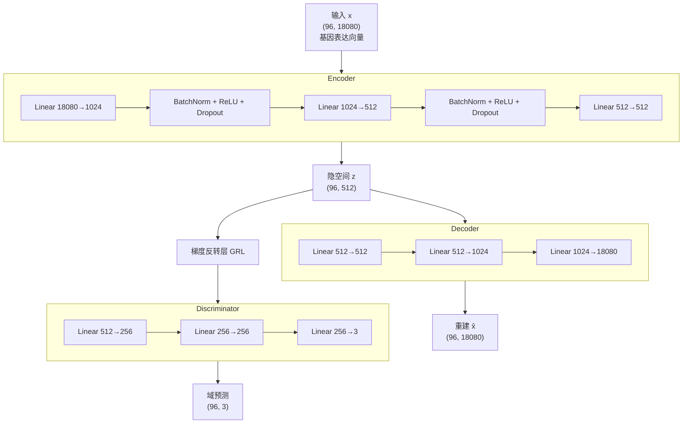
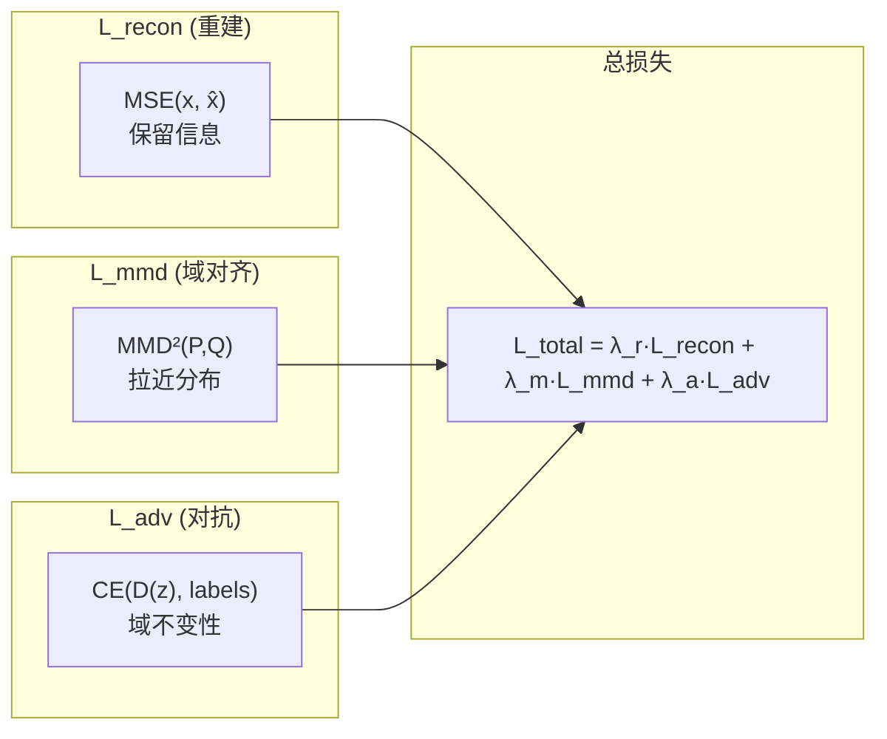
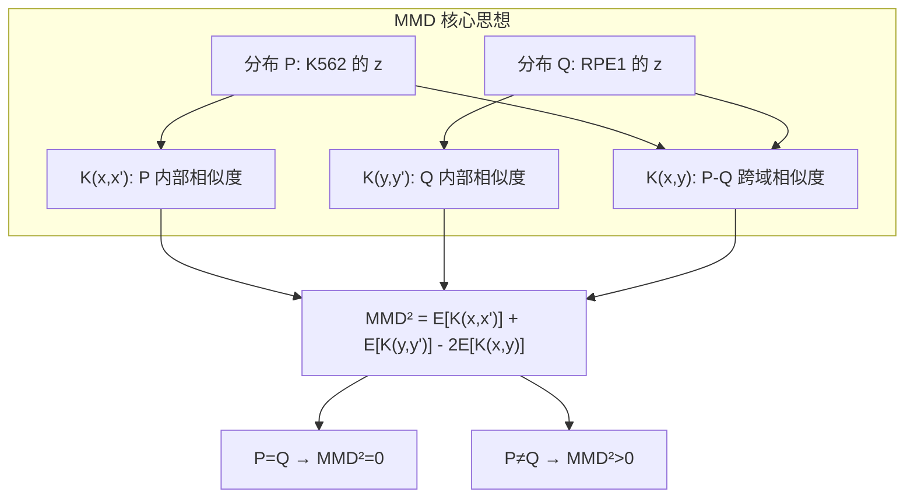
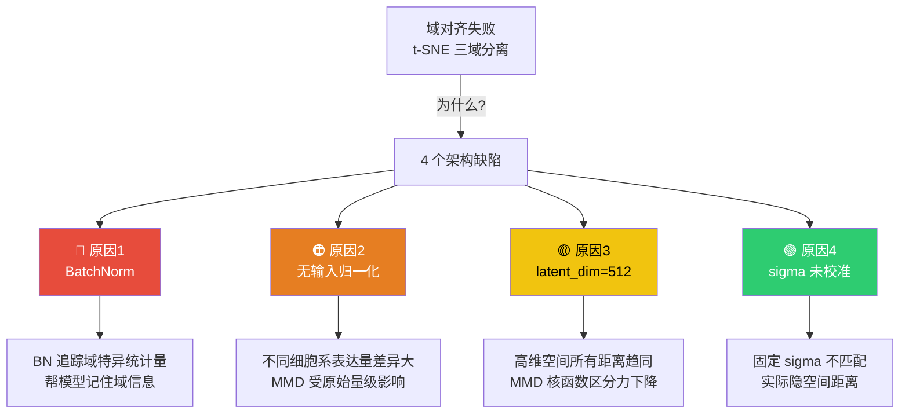
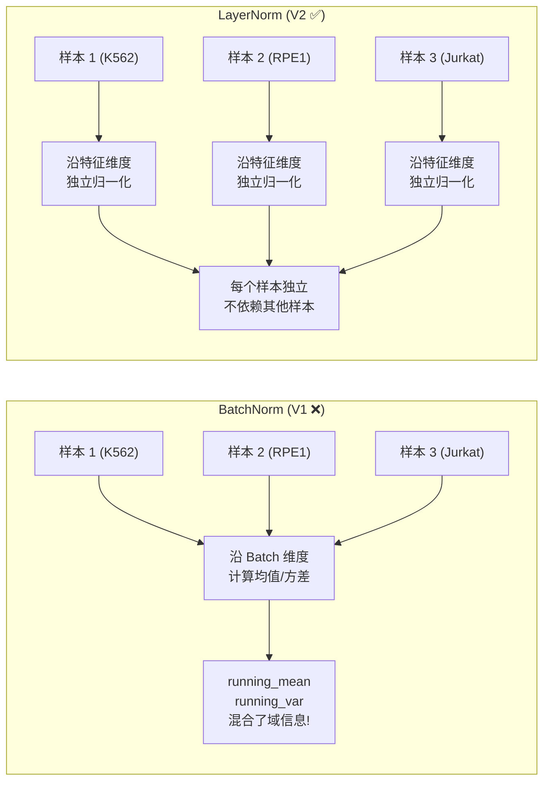
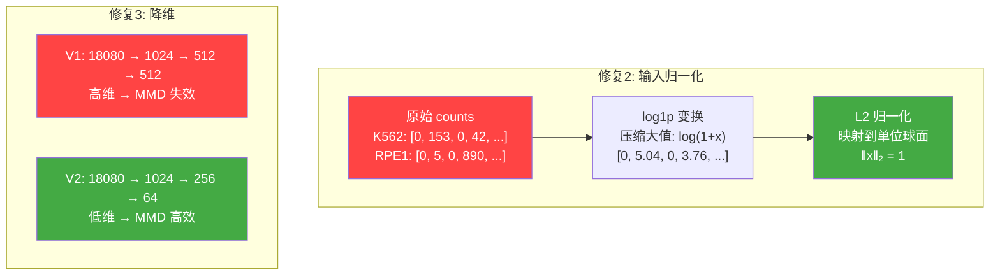
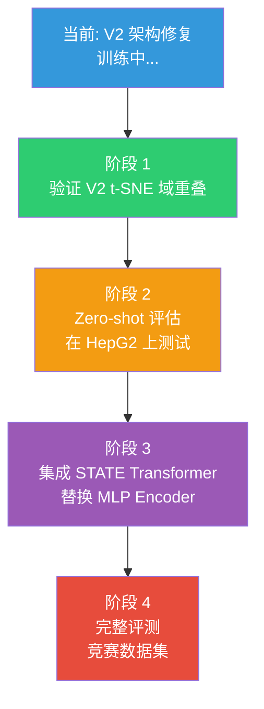

# MMD-AAE 项目进展汇报 (Slides)

---

## Slide 1: 项目概述

### 📊 视觉



### 📝 文字内容

**项目目标**: 基于 MMD-AAE 实现多域细胞基因表达的域不变特征学习

**核心挑战**: 不同细胞系（K562/RPE1/Jurkat）的基因表达分布差异大，模型需要学习域不变的隐空间表示

**方法**: MMD-AAE = AutoEncoder + MMD 域对齐 + 对抗训练

### 🎤 讲解内容

> 我们的项目目标是在 STATE 框架中引入 MMD-AAE 模块，解决多域细胞数据的域偏移问题。我们使用三种细胞系——K562（血癌细胞）、RPE1（视网膜色素上皮细胞）、Jurkat（T 细胞淋巴瘤）作为训练数据，共约 62000 个细胞。核心思路是通过自编码器学习隐空间表示，同时用 MMD 和对抗训练两种机制强制这个隐空间实现"域不变"——即不同细胞系的表示混合在一起，无法区分来源。

---

## Slide 2: 三路并行 DataLoader 设计

### 📊 视觉



### 📝 文字内容

**为什么需要三路并行？**

| 方案 | 做法 | 问题 |
|------|------|------|
| ConcatDataset | 合并后随机采样 | ❌ 域不平衡：某个 batch 可能 80 个 K562 + 16 个 RPE1 |
| **ParallelZipLoader** | 三路独立 + zip 同步 | ✅ 每域恰好 32 个，总 96 |

**关键参数**: `drop_last=True` 丢弃尾部不完整 batch

### 🎤 讲解内容

> 数据加载是 MMD-AAE 的第一个关键设计。因为我们需要计算不同域之间的 MMD，所以每个 mini-batch 必须包含来自所有三个域的平衡样本。如果用 ConcatDataset 简单合并，shuffle 后某些 batch 可能只有一两个域的样本，导致 MMD 无法计算。
>
> 我们的解决方案是三路并行 DataLoader：为每个域创建独立的 DataLoader，然后用 Python 的 zip 函数同步迭代。这样每次取出三个 batch（各 32 个样本），拼成一个 96 样本的大 batch，保证域完全平衡。drop_last=True 确保最后不完整的 batch 被丢弃，避免 zip 长度不一致。

---

## Slide 3: 模型架构

### 📊 视觉



### 📝 文字内容

| 组件 | 结构 | 参数量 | 作用 |
|------|------|--------|------|
| Encoder | 18080→1024→512→512 | ~19M | 压缩到隐空间 |
| Decoder | 512→512→1024→18080 | ~19M | 从隐空间重建 |
| Discriminator | 512→256→256→3 | ~200K | 判别域标签 |
| GRL | 梯度×(-1) | 0 | 反转对抗梯度 |

### 🎤 讲解内容

> 模型由三个主要组件构成。Encoder 将 18080 维的基因表达向量压缩到 512 维的隐空间表示。Decoder 从隐空间重建原始输入，确保重要信息不丢失。Discriminator 尝试从隐空间表示中判别样本来自哪个域。
>
> 关键创新是梯度反转层 GRL——它在前向传播时不做任何操作，但在反向传播时将梯度乘以 -1。这意味着 Discriminator 越能区分域，反向传播回 Encoder 的梯度就越会推动 Encoder 生成"更难区分"的表示，形成对抗博弈。

---

## Slide 4: 三个损失函数

### 📊 视觉



### 📝 文字内容

| 损失 | 公式 | 含义 | 理想值 |
|------|------|------|--------|
| **L_recon** | MSE(x, Decoder(Encoder(x))) | 重建质量 | < 0.15 |
| **L_mmd** | E[K(x,x')] + E[K(y,y')] - 2E[K(x,y)] | 域间距离 | → 0 |
| **L_adv** | -Σ log(softmax(D(z))_domain) | 域判别难度 | ≈ log(3) = 1.099 |

**总损失**: L_total = 1.0 × L_recon + λ_m × L_mmd + 0.5 × L_adv

### 🎤 讲解内容

> 我们的损失函数由三部分组成。L_recon 是均方误差，确保 Encoder 保留足够的基因表达信息。L_mmd 是最大均值差异，直接度量不同域在隐空间中的分布差异并最小化它。L_adv 是对抗损失，通过梯度反转让 Encoder 学习生成 Discriminator 无法区分的特征。
>
> 三者的权重平衡是关键——L_recon 权重固定为 1.0，L_mmd 是我们重点调节的参数，L_adv 权重通常较小以避免训练不稳定。理想情况下，L_adv 应该接近 log(3)≈1.099，即三分类的随机猜测熵，说明 Discriminator 完全无法判别。

---

## Slide 5: MMD 损失详解

### 📊 视觉



### 📝 文字内容

**RBF 核函数**: K(a, b) = exp(-γ × ‖a - b‖²)

**多核策略**: 使用5个不同的 σ 捕捉多尺度差异:
- σ = 0.01: 局部细节
- σ = 1.0: 中等尺度
- σ = 100: 全局结构

**三域两两计算**:
```
L_mmd = mean(MMD(K562,RPE1), MMD(K562,Jurkat), MMD(RPE1,Jurkat))
```

### 🎤 讲解内容

> MMD 的核心思想是：如果两个分布相同，对它们应用任何核函数后的期望值应该相等。我们使用 RBF 高斯核，它本质上在衡量两个点的相似度——距离越近，核函数值越接近 1。
>
> MMD² 可以直观理解为：P 内部的平均相似度 + Q 内部的平均相似度 - 2 倍跨分布的平均相似度。如果 P 和 Q 相同，这三项应该相等，所以 MMD²=0。
>
> 我们使用多个不同 σ 的 RBF 核，因为单一 σ 只能捕捉特定尺度的差异。小 σ 对局部差异敏感，大 σ 对全局差异敏感，多核组合更加鲁棒。对三个域，我们计算所有两两组合的 MMD 取平均。

---

## Slide 6: V1 训练结果 — 数值

### 📊 视觉

| 阶段 | Epoch | Recon | MMD | Adv | 问题 |
|------|-------|-------|-----|-----|------|
| 初始训练 | 1 | 0.60 | **0.0625** | 1.05 | — |
| 初始训练 | 10 | 0.15 | **0.0625** | 1.07 | ⚠️ MMD 不变! |
| 初始训练 | 20 | 0.13 | **0.0625** | 1.09 | ❌ MMD 完全固定 |
| — | — | — | — | — | 🔧 **发现并修复梯度断开 Bug** |
| 修复后 | 1 | 0.55 | 0.065 | 1.02 | — |
| 修复后 | 10 | 0.14 | 0.045 | 1.08 | MMD 开始下降 ✅ |
| 修复后 | 20 | 0.129 | **0.040** | 1.095 | Adv ≈ log(3) ✅ |

### 📝 文字内容

**Bug 原因**: `mmd_loss = torch.tensor(0.0)` 创建的张量没有梯度图连接

**修复方法**: 改为 `mmd_loss = x.new_zeros(1)` 保持与输入在同一计算图

### 🎤 讲解内容

> 在初始训练中我们发现 MMD 损失固定在 0.0625 完全不变，这意味着域对齐完全没有生效。经过排查，发现是梯度流断开的问题——我们用 torch.tensor(0.0) 初始化累加变量，这会创建一个不在计算图中的新张量，导致后续的 MMD 计算无法将梯度传回 Encoder。
>
> 修复后使用 x.new_zeros(1)，它会创建一个与输入 x 在同一设备、同一计算图中的零张量。修复后可以看到 MMD 从 0.065 下降到 0.04，说明域对齐开始工作了。同时 Adv 损失稳定在 1.095，非常接近理论最优值 log(3)=1.099。

---

## Slide 7: V1 训练结果 — t-SNE 可视化

### 📊 视觉

````carousel

<!-- slide -->

````

### 📝 文字内容

| 实验 | λ_mmd | Epochs | 结果 |
|------|-------|--------|------|
| Exp 1 | 20.0 | 200 | ❌ 三域完全分离 |
| Exp 2 | 10.0 | 200 | 🟡 轻微交叉，仍分离 |

**观察**: λ_mmd=10 比 λ_mmd=20 效果更好 → 权重过大反而有害

**结论**: 单纯调 lambda 无法解决域对齐问题

### 🎤 讲解内容

> 这是我们 V1 模型的 t-SNE 可视化结果。左图是 λ_mmd=20 训练 200 轮的结果，可以清楚看到红色 K562、蓝色 RPE1、绿色 Jurkat 三个域完全分开，域对齐完全失败。
>
> 右图是 λ_mmd=10 的结果，虽然有一点点交叉区域，但三个域整体仍然明显分离。有趣的是 λ_mmd=10 反而比 λ_mmd=20 效果好，说明 MMD 权重过大可能导致训练不稳定。
>
> 我们尝试了多种 lambda 组合（从 1 到 20），训练也从 20 轮增加到 200 轮，但都无法实现域重叠，说明这不是超参数调优的问题，而是架构层面的根本缺陷。

---

## Slide 8: V1 失败根因分析

### 📊 视觉



### 📝 文字内容

| 优先级 | 原因 | 影响程度 |
|--------|------|----------|
| ⭐⭐⭐ | **BatchNorm 泄露域信息** | 最致命 |
| ⭐⭐ | **无输入归一化** | 严重 |
| ⭐⭐ | **隐空间维度过大 (512)** | 严重 |
| ⭐ | **sigma 未校准** | 中等 |

### 🎤 讲解内容

> 经过深入分析，我们发现域对齐失败有四个架构层面的根本原因。
>
> 最严重的是 BatchNorm——它在训练时为每个 mini-batch 计算均值和方差的 running statistics。由于不同域的数据分布不同，BN 实际上在帮模型"记住"域信息，这直接对抗了我们的域对齐目标。这是域适应领域的已知问题。
>
> 其次是没有对输入做归一化，不同细胞系的原始基因表达量级差异很大。第三是隐空间维度 512 太大，在高维空间中 MMD 核函数的区分力会急剧下降，这就是所谓的"维度灾难"。最后是 MMD 的 sigma 参数使用固定值，没有根据实际数据距离自适应调整。

---

## Slide 9: V2 修复 — BatchNorm → LayerNorm

### 📊 视觉



### 📝 文字内容

```diff
# V1 (问题)
- nn.BatchNorm1d(1024)   # 追踪全局 running_mean / running_var

# V2 (修复)
+ nn.LayerNorm(1024)     # 每个样本内部归一化，与 batch 无关
```

| 归一化方式 | 计算维度 | 是否依赖 batch | 域适应适用性 |
|-----------|----------|---------------|------------|
| BatchNorm | batch 维度 | ✅ 是 | ❌ 不适合 |
| **LayerNorm** | **特征维度** | **❌ 否** | **✅ 推荐** |

### 🎤 讲解内容

> 第一个也是最关键的修复是将 BatchNorm 替换为 LayerNorm。BatchNorm 沿 batch 维度计算归一化统计量，这意味着它的 running_mean 和 running_var 隐式编码了训练数据的域分布信息。在推理时，这些统计量会帮助模型识别样本来自哪个域，相当于给 Encoder 一个"作弊"的捷径。
>
> LayerNorm 则完全不同——它沿特征维度归一化，每个样本完全独立处理，不依赖同 batch 中的其他样本。这使得归一化过程与域完全无关，是域适应任务中的标准选择。

---

## Slide 10: V2 修复 — 输入归一化 + 隐空间压缩

### 📊 视觉



### 📝 文字内容

**修复 2: 输入归一化**
```python
counts = torch.log1p(counts)     # 压缩大值: 890 → 6.79
counts = counts / counts.norm(2) # 映射到单位球面
```

**修复 3: 隐空间 512 → 64**

| 维度 | MMD 效果 | 原因 |
|------|---------|------|
| 512 | ❌ 失效 | 高维空间距离趋同（维度灾难） |
| **64** | ✅ 有效 | 低维空间距离有区分力 |

**修复 4: Median heuristic**
```python
median_dist = all_pairwise_distances.median()
sigmas = [median_dist × 0.1, 0.25, 0.5, 1.0, 2.0, 5.0]
```

### 🎤 讲解内容

> 修复 2 是输入归一化。不同细胞系的原始基因表达量级差异很大，比如某个基因在 K562 中表达 153，在 RPE1 中表达 890。我们先做 log1p 变换压缩大值，再做 L2 归一化将所有样本映射到单位球面上。这消除了域间的量级差异，让 MMD 在标准化的空间中计算。
>
> 修复 3 是缩小隐空间维度。在 512 维空间中，所有点对之间的距离会趋向相同，核函数的区分力大幅下降。降到 64 维后，MMD 能更有效地检测和缩小分布差异，同时更小的瓶颈也迫使 Encoder 丢弃域特异的细节。
>
> 修复 4 是 MMD 的 sigma 自动校准。之前使用固定的 sigma 值可能不匹配实际数据距离，现在我们用 median heuristic——取所有点对距离的中位数作为基准，然后在中位数的不同倍率上设置多个核。

---

## Slide 11: V1 vs V2 完整对比

### 📊 视觉

| 组件 | V1 | V2 | 改进原因 |
|------|-----|-----|---------|
| **归一化层** | BatchNorm | **LayerNorm** | 避免域信息泄露 |
| **输入处理** | 原始 counts | **log1p + L2** | 消除量级差异 |
| **隐空间** | 512 维 | **64 维** | MMD 维度灾难 |
| **MMD sigma** | 固定 5 值 | **Median heuristic** | 自适应数据 |
| **学习率** | 1e-4 | **1e-3** | 更快收敛 |
| **LR 最低值** | 0 | **1e-5** | 避免完全停止 |
| **Encoder** | 18080→1024→512→512 | **18080→1024→256→64** | 更强压缩 |
| **参数量** | ~38M | **~20M** | 更轻量 |

### 🎤 讲解内容

> 这里是 V1 和 V2 的完整对比。V2 的每一项修改都有明确的理论依据。LayerNorm 解决域信息泄露，输入归一化消除量级差异，降低隐空间维度解决维度灾难，median heuristic 让 MMD 自适应数据分布。此外我们提高了学习率到 1e-3 加速收敛，并设置了最低学习率 1e-5 确保训练后期不会完全停止。整体参数量也从 38M 降到了 20M。

---

## Slide 12: 下一步计划

### 📊 视觉



### 📝 文字内容

| 阶段 | 任务 | 预期产出 |
|------|------|---------|
| 1 | V2 实验验证 | t-SNE 图中三域重叠 |
| 2 | Zero-shot 评估 | HepG2 预测性能 |
| 3 | 集成 Transformer | 用 Transformer 替换 MLP |
| 4 | 竞赛评测 | 最终排名提升 |

### 🎤 讲解内容

> 目前 V2 实验已经在服务器上通过 tmux 后台运行。下一步首先验证 V2 的 t-SNE 可视化是否实现域重叠。如果成功，我们将在未见过的 HepG2 细胞系上进行 zero-shot 测试，验证模型的跨域泛化能力。
>
> 之后计划将 MMD-AAE 的 Encoder 替换为 Transformer 架构，利用 STATE 原有的自注意力机制处理基因间关系，进一步提升表示能力。最终目标是在竞赛数据集上取得更好的排名。

---

## Slide 13: 总结

### 📝 文字内容

**已完成工作**:
- ✅ MMD-AAE 完整框架实现 (~1300 行代码)
- ✅ 三路并行 DataLoader
- ✅ 三损失函数 + 梯度修复
- ✅ 实验管理系统 (CLI 参数 + tmux 批量实验)
- ✅ t-SNE 可视化工具
- ✅ V2 架构修复 (4 项优化)

**关键发现**:
- 🔍 BatchNorm 是域适应任务的"隐形杀手"
- 🔍 高维隐空间导致 MMD 维度灾难
- 🔍 lambda 调优不能解决架构缺陷

### 🎤 讲解内容

> 总结一下，我们已经完成了 MMD-AAE 的完整框架实现，包括数据加载、模型训练、实验管理和可视化，总计约 1300 行代码。通过 V1 的反复实验，我们发现了四个架构层面的关键问题，并在 V2 中全部修复。最重要的发现是 BatchNorm 和高维隐空间是域对齐失败的根本原因，单纯调整 lambda 无法解决。V2 实验正在运行中，预期将实现真正的域对齐。谢谢大家。
