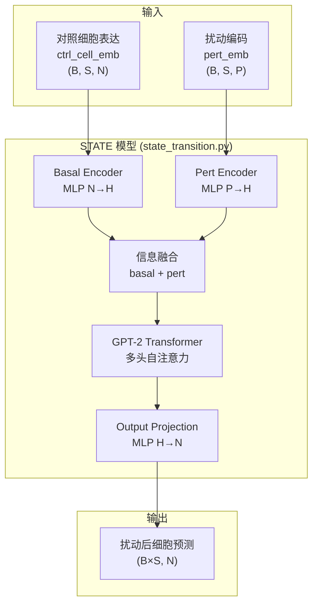
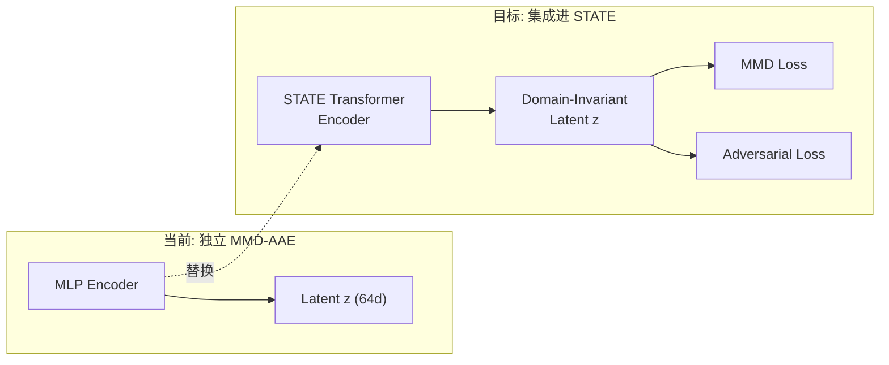

# MMD-AAE 项目全面总结

## 一、原始 STATE 框架回顾

### 1.1 STATE 核心架构

STATE 是一个基于 **Transformer** 的基因扰动预测模型，核心思想是**集合到集合 (Set-to-Set)** 学习。



### 1.2 STATE 关键组件

| 组件 | 文件 | 说明 |
|------|------|------|
| **核心模型** | `state_transition.py` (917行) | Transformer 主干 + 残差预测 |
| **基础类** | `base.py` | `PerturbationModel` 抽象基类 |
| **解码器** | `decoders.py`, `decoders_nb.py` | 基因空间解码 + 负二项分布 |
| **工具函数** | `utils.py` | MLP 构建、Transformer 初始化、LoRA |
| **嵌入** | `emb/` (22 文件) | 基因嵌入、推理、微调、VectorDB |
| **CLI** | `_cli/` (13 文件) | 命令行训练/评估接口 |
| **配置** | `configs/` (27 文件) | YAML 配置文件 |

### 1.3 STATE 的损失函数

```python
# 原始 STATE 使用分布距离损失
loss_fn = SamplesLoss("energy")   # 基于 geomloss 的 Energy Distance
# 或
loss_fn = SamplesLoss("sinkhorn") # Sinkhorn (最优传输) 距离
# 或
loss_fn = CombinedLoss(sinkhorn_weight=0.01, energy_weight=1.0)
```

### 1.4 STATE 已有但被注释的尝试

在 `state_transition.py` 中的注释代码 (L102-L167, L603-L642) 显示，曾尝试直接在 STATE Transformer 内添加：
- `MMDLoss`: RBF 核 MMD (被注释)
- `ClusteringLoss`: 扰动聚类损失 (被注释)

> [!IMPORTANT]
> 这些被注释掉了，说明直接在 STATE 内部加 MMD 可能遇到了问题。我们的方案是**独立构建 MMD-AAE 预训练模块**，然后集成回 STATE。

---

## 二、我们完成的工作

### 2.1 新增代码文件

| 文件 | 用途 | 行数 |
|------|------|------|
| [train_mmd_aae.py](file:///Users/yiyidaishui/PycharmProjects/STATE-1/src/train_mmd_aae.py) | MMD-AAE 训练主脚本 (v2) | ~350 |
| [visualize_mmd_aae.py](file:///Users/yiyidaishui/PycharmProjects/STATE-1/src/visualize_mmd_aae.py) | t-SNE 可视化 (自动架构检测) | ~290 |
| [verify_mmd_aae.py](file:///Users/yiyidaishui/PycharmProjects/STATE-1/src/verify_mmd_aae.py) | DataLoader + MMD 验证脚本 | ~300 |
| [verify_h5_data.py](file:///Users/yiyidaishui/PycharmProjects/STATE-1/src/verify_h5_data.py) | H5 数据完整性检查 | ~200 |
| [run_mmd_aae_simple.py](file:///Users/yiyidaishui/PycharmProjects/STATE-1/src/run_mmd_aae_simple.py) | 简化训练启动器 | ~170 |
| [run_mmd_aae_train.py](file:///Users/yiyidaishui/PycharmProjects/STATE-1/src/run_mmd_aae_train.py) | 配置化训练启动 | ~60 |
| [run_experiments.sh](file:///Users/yiyidaishui/PycharmProjects/STATE-1/src/run_experiments.sh) | tmux 批量实验脚本 v1 | ~80 |
| [run_experiments_v2.sh](file:///Users/yiyidaishui/PycharmProjects/STATE-1/src/run_experiments_v2.sh) | tmux 批量实验脚本 v2 | ~50 |
| **总计新增代码** | | **~1500 行** |

### 2.2 新增文档

| 文档 | 内容 |
|------|------|
| [Framework_Analysis.md](file:///Users/yiyidaishui/PycharmProjects/STATE-1/docs/Framework_Analysis.md) | MMD-AAE 框架详细分析 |
| [DataLoader_and_MMD_Explained.md](file:///Users/yiyidaishui/PycharmProjects/STATE-1/docs/DataLoader_and_MMD_Explained.md) | 三路 DataLoader + MMD 原理 |
| [Loss_Functions_Explained.md](file:///Users/yiyidaishui/PycharmProjects/STATE-1/docs/Loss_Functions_Explained.md) | 三个损失函数详解 |
| [Loss_Tuning_Guide.md](file:///Users/yiyidaishui/PycharmProjects/STATE-1/docs/Loss_Tuning_Guide.md) | Lambda 调参指南 |
| [Progress_Report.md](file:///Users/yiyidaishui/PycharmProjects/STATE-1/docs/Progress_Report.md) | PPT 式进展报告 |
| [Presentation_Slides.md](file:///Users/yiyidaishui/PycharmProjects/STATE-1/docs/Presentation_Slides.md) | 学术汇报幻灯片 |
| [MMD_AAE_README.md](file:///Users/yiyidaishui/PycharmProjects/STATE-1/docs/MMD_AAE_README.md) | 快速入门文档 |

### 2.3 完成的工作清单

#### ✅ 已完成

- [x] **MMD-AAE 独立模型**: Encoder + Decoder + Discriminator + GRL
- [x] **三路并行 DataLoader**: `SimpleH5Dataset` + `ParallelZipLoader`
- [x] **三个损失函数**: L_recon (MSE) + L_mmd (多核 RBF) + L_adv (CE + GRL)
- [x] **梯度修复**: `torch.tensor(0.0)` → `x.new_zeros(1)` 修复 MMD 梯度断开
- [x] **实验管理**: CLI 参数、实验命名、检查点保存、tmux 批量运行
- [x] **V2 架构改进**: BatchNorm→LayerNorm、输入归一化、latent_dim 压缩、median heuristic
- [x] **t-SNE 可视化**: 自动架构检测、密度等高线、域重叠分析
- [x] **完整文档**: 7 篇技术文档覆盖原理、实现、调参

---

## 三、尚未完成的工作

### 3.1 当前阻塞 ⛔

| 任务 | 状态 | 说明 |
|------|------|------|
| **域对齐验证** | 🔴 阻塞 | V2 架构修复后的 t-SNE 结果还未确认域是否重叠 |
| **可视化点数问题** | 🔴 待排查 | t-SNE 图中点过少，可能是架构不匹配 |

### 3.2 短期待做 (1-2 周)

| 优先级 | 任务 | 说明 |
|--------|------|------|
| ⭐⭐⭐ | **确认 V2 域对齐** | 检查 V2 t-SNE 是否三域重叠 |
| ⭐⭐⭐ | **进一步架构调优** | 若V2仍不对齐，可能需要更激进的修改 |
| ⭐⭐ | **Zero-shot 评估** | 在未见过的 HepG2 细胞系上测试泛化 |
| ⭐⭐ | **定量评估指标** | 除 t-SNE 外，加入 Silhouette 分数、域分类准确率等数值指标 |

### 3.3 中期目标 (集成到 STATE)



| 任务 | 说明 |
|------|------|
| **替换 Encoder** | 用 STATE 的 Transformer backbone 替换 MLP Encoder |
| **添加 MMD 到 STATE 训练循环** | 将 `compute_mmd_multi_kernel` 加入 `training_step` |
| **添加 Discriminator** | 在 STATE 的隐层输出上加 GRL + Discriminator |
| **多域训练** | 使 STATE 的 DataModule 支持同时加载 K562/RPE1/Jurkat |
| **端到端训练** | 扰动预测 + 域对齐同时优化 |

### 3.4 长期目标

| 任务 | 说明 |
|------|------|
| **竞赛评测** | 在完整竞赛数据集上测评 |
| **消融实验** | 对比 STATE vs STATE+MMD 的性能差异 |
| **跨细胞系零样本** | 在完全未见过的细胞系上预测扰动效果 |

---

## 四、STATE 原始代码 vs 我们的修改对比

### 4.1 未修改的部分

```
src/state/               # 原始 STATE 代码, 未修改
├── tx/
│   ├── models/
│   │   ├── state_transition.py  ← 核心模型 (未修改)
│   │   ├── base.py              ← 基类 (未修改)
│   │   └── ...
│   ├── data/                    ← 数据加载 (未修改)
│   └── callbacks/               ← 训练回调 (未修改)
├── emb/                         ← 嵌入系统 (未修改)
├── _cli/                        ← CLI 接口 (未修改)
└── configs/                     ← 配置文件 (未修改)
```

### 4.2 新增的部分

```
src/                     # 新增 MMD-AAE 模块
├── train_mmd_aae.py     ← 🆕 训练脚本
├── visualize_mmd_aae.py ← 🆕 可视化
├── verify_mmd_aae.py    ← 🆕 验证脚本
├── verify_h5_data.py    ← 🆕 数据检查
├── run_experiments*.sh  ← 🆕 批量实验
└── run_mmd_aae_*.py     ← 🆕 启动脚本

docs/                    # 新增文档
├── Framework_Analysis.md      ← 🆕
├── DataLoader_and_MMD_Explained.md ← 🆕
├── Loss_Functions_Explained.md    ← 🆕
├── Loss_Tuning_Guide.md          ← 🆕
├── Progress_Report.md            ← 🆕
├── Presentation_Slides.md        ← 🆕
└── MMD_AAE_README.md             ← 🆕
```

> [!NOTE]
> **我们没有修改任何原始 STATE 代码**。MMD-AAE 作为独立模块开发，验证有效后再集成。

---

## 五、关键经验与发现

| 发现 | 影响 |
|------|------|
| `torch.tensor(0.0)` 会断开梯度图 | 必须用 `x.new_zeros(1)` |
| BatchNorm 泄露域信息 | 域适应任务必须用 LayerNorm |
| latent_dim 过大导致 MMD 失效 | 维度灾难，需降至 64~128 |
| Lambda 调优无法弥补架构缺陷 | 先修架构再调参数 |
| STATE 内部曾尝试 MMD 被注释 | 说明直接嵌入困难，独立模块更可行 |
